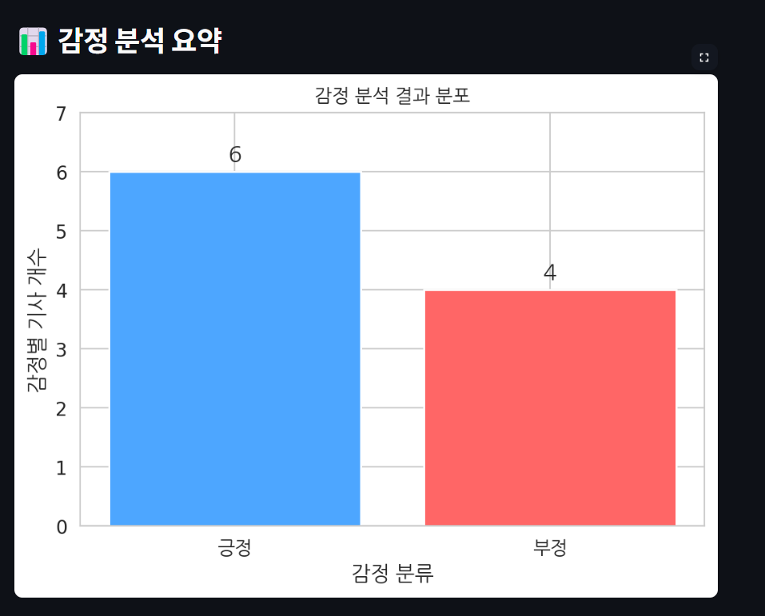
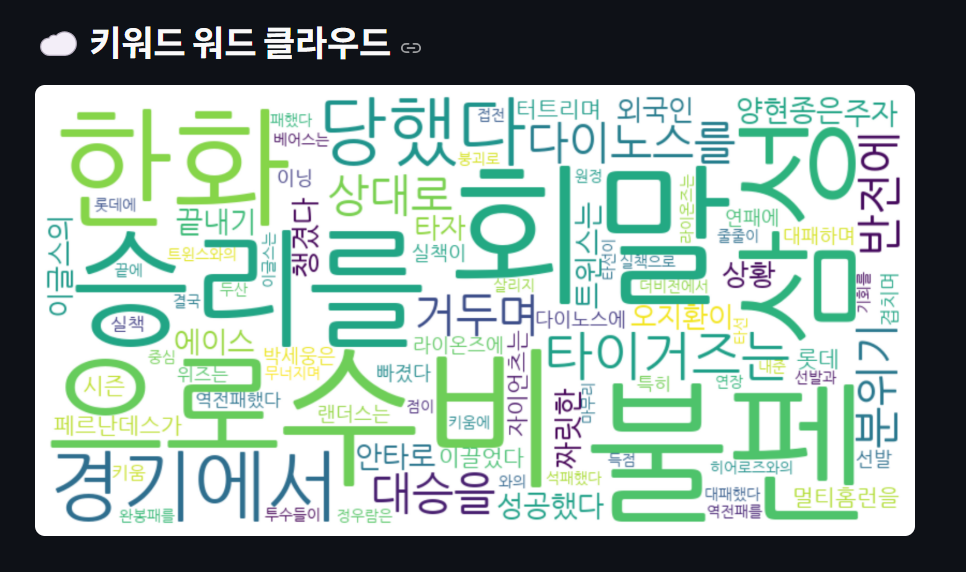

# # ⚾ 스포츠 기사 감정 분석 시스템

> https://baseball-eakcz9yj5vkkjrhbmbxjja.streamlit.app/

> Streamlit 기반 웹 애플리케이션으로, **야구 뉴스 기사**를 업로드하면 `감정 분석 결과`, `긍정/부정 비율`, `워드 클라우드`, `핵심 키워드` 등을 시각화하여 보여줍니다.

<br/>

## 🚀 주요 기능

- 🔍 **감정 분석**: KoBERT 기반 모델을 사용한 긍정/부정 예측
- 📊 **감정 비율 시각화**: 기사별 긍정/부정 점수를 시각적으로 제공
- ☁️ **워드클라우드 생성**: 기사 전체 키워드 기반 시각화 제공
- 🧠 **스포츠 기사 맞춤 보정**: 스포츠 문맥에 맞는 긍/부정 키워드 사전 적용
- 🧪 **Streamlit 웹 UI**: 간단한 업로드만으로 바로 분석 가능

<br/>

## 🖼️ 데모 화면

| 감정 분석 결과 | 워드 클라우드 |
|----------------|----------------|
|  |  |

<br/>

## 📁 파일 구조

📦baseball-sentiment 
┣ app.py # Streamlit 메인 실행 파일 
┣ sentiment_model.py # 감정 분석 로직 (KoBERT 기반) 
┣ keyword_extractor.py # 키워드 추출 로직 
┣ requirements.txt # 필요한 패키지 목록 
┣ sample_input.txt # 테스트용 기사 파일 
┣ NanumGothic.ttf # 한글 깨짐 방지용 폰트 
┗ README.md # 현재 파일


<br/>

## 🛠️ 설치 및 실행

```bash
# 1. 의존성 설치
pip install -r requirements.txt

# 2. Streamlit 앱 실행
streamlit run app.py

📝 사용 방법
sample_input.txt 형식처럼 여러 개의 기사 작성 (기사 간 빈 줄 5줄 이상!)

.txt 파일 업로드

감정 분석 결과, 점수, 시각화 확인!

<br/>
🧠 기술 스택
Python 3.10+

Streamlit

KoBERT (transformers)

WordCloud

Matplotlib, Seaborn

HuggingFace Transformers

<br/>
📌 참고 사항
한글 깨짐 방지를 위해 NanumGothic.ttf 포함

분석 대상은 스포츠 뉴스 기사에 최적화되어 있습니다

긍정/부정 판단은 확률 기반이며 완벽하지 않을 수 있습니다

기사 사이에는 반드시 Enter 5번 이상으로 구분해주세요

<br/>
🙌 기여 & 문의
본 프로젝트는 인공지능 전공 수업의 미니 프로젝트로 진행되었습니다.
궁금한 사항이나 기능 제안은 Issue로 남겨주세요!


